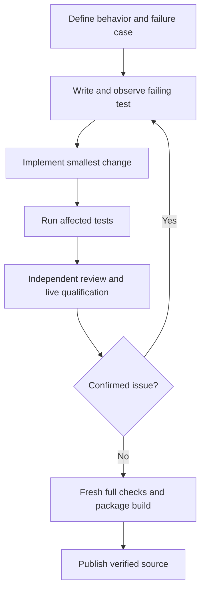

# Development workflow

Keep changes small and preserve the provider-neutral mailbox contract.

1. Describe the behavior and relevant failure case.
2. Add a behavioral test and observe the expected failure.
3. Implement the smallest fix, then run the affected tests.
4. Review routing, duplicate handling, limits, permission boundaries and process cleanup.
5. Add regression tests for confirmed review findings. Fix and retest.
6. Run the full suite, lint, formatting and package build before publishing.



```sh
uv sync --locked --python 3.12
uv run pytest -q
uv run ruff check .
uv run ruff format --check .
uv build
```

CI never calls a model or needs provider credentials. Runtime adapter tests use small
fake executables at the external protocol boundary; broker and MCP tests use real
SQLite connections and real MCP subprocesses.

Live tests consume provider quota. Use a new ignored state directory for each demo;
preserve failed evidence privately. Never automatically retry an ambiguous turn.
Keep private config, credentials, local paths and raw transcripts out of Git.

To add a runtime, implement `Runtime.start`, `turn`, and `close` from
`src/peercourier/runtime.py`. Return a stable resumable session ID and explicit errors.
Add it to the CLI adapter registry and test the actual protocol, session resume,
output bounds and owned-process cleanup. The mailbox does not need provider changes.
