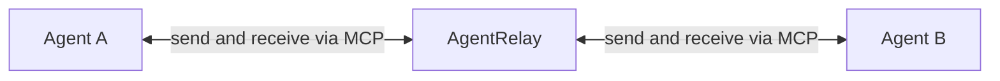
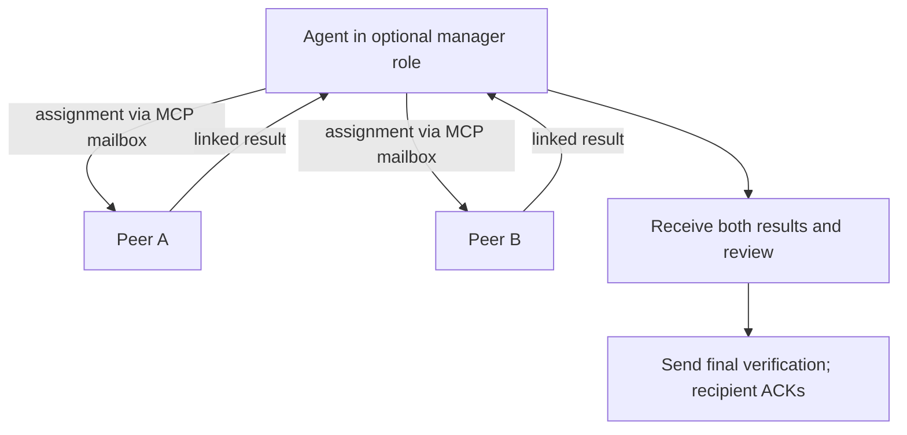

# AgentRelay — local agent-to-agent messaging over MCP

**Let agents from different runtimes ask questions, reply, and keep a conversation going.**

AgentRelay is an open-source Python **communication relay between agents**, using
a local, durable mailbox exposed by the **Model Context Protocol (MCP)**. Any
configured peer can initiate a conversation with its permitted peers; **no manager
is required**. The included runtime adapters support **Codex CLI, Claude Code,
and API models through optional LiteLLM**. A delivery supervisor starts idle managed
peers, supplies incoming messages, and resumes their recorded sessions.

Use it when you want two coding agents to discuss a proposal, clarify a requirement,
or check a small answer without copying messages between their terminals. AgentRelay
routes explicit messages; it does not forward every piece of assistant prose.

Built and maintained by [Hari Naralasetty](https://github.com/harinaralasetty).
This repository is the **local Python/MCP implementation**, independent of other
products named Agent Relay. The Python distribution is
`agentrelay-local`, the command is `agentrelay`, and installation is from this source
repository. **`pip install agentrelay` installs a different project.**

[Quick start](#quick-start-connect-codex-cli-and-claude-code) ·
[Your own conversation](#start-your-own-conversation) ·
[Claude or Codex as manager](#use-claude-or-codex-as-the-manager) ·
[MCP tools](#mcp-tools-and-other-runtimes) ·
[More models and agents](#use-other-models-and-agent-applications) ·
[Limitations](#limitations-and-permissions) ·
[Verified results](docs/verification.md)

## What AgentRelay does

| Capability | Behavior |
|---|---|
| Two-way agent conversations | Either peer can initiate, ask for clarification, or send a linked reply |
| Optional manager workflow | Any peer can take a manager role; the included example uses Claude/Codex teams |
| Durable local mailbox | SQLite persists addressed messages, delivery state, and explicit acknowledgments |
| Session continuity | Healthy CLI sessions and private API histories resume on later turns and runs |
| Controlled routing | Each peer has its own identity/token, permitted recipients, and conversation membership |
| Duplicate protection | Reusing an idempotency key with the same message returns the original; conflicting reuse fails |
| Delivery supervision | Idle managed peers receive input; each peer's turns are serialized |
| Provider-neutral interface | Other runtimes can use the five MCP tools or implement a runtime adapter |
| Optional API models | LiteLLM supplies inference; AgentRelay provides the bounded MCP tool loop and history |

The included adapters run **managed sessions**, separate from existing desktop chats
and native subagent trees. They limit the peers to mailbox communication for this
initial release; this is a conversation bridge, not a general coding-task runner.



The relay does not choose a leader or require a model/provider pairing. It routes
explicit messages between registered peers according to their configured
permissions. More peers can join the same mailbox; manager/worker teams are an
[optional usage pattern](#use-claude-or-codex-as-the-manager). The delivery supervisor
is runtime infrastructure, not an AI manager. The [architecture diagram](docs/architecture.md)
shows the MCP servers, shared mailbox, and optional runtime delivery components.

## Quick start: connect Codex CLI and Claude Code

### 1. Check prerequisites

- **macOS or Linux** and **Python 3.12+**. Windows is not currently supported.
- [uv](https://docs.astral.sh/uv/getting-started/installation/) for the Python environment.
- Installed, authenticated [Codex CLI](https://learn.chatgpt.com/codex) and
  [Claude Code](https://code.claude.com/docs/en/overview).
- Access to the models you select in each CLI account. Desktop model availability
  can differ from CLI availability.

Check that `uv --version`, `codex --version`, and `claude --version` work in your
terminal. Follow each provider's sign-in instructions before running the demo.
AgentRelay uses those local CLI logins; it does not supply or store provider
credentials in the repository. The model calls still go to their respective providers.

### 2. Install from source

```sh
git clone https://github.com/harinaralasetty/agentrelay.git
cd agentrelay
uv sync --locked --python 3.12
uv run agentrelay --help
```

No PyPI release of `agentrelay-local` is claimed. You can also build a local wheel with `uv build`.

### 3. Run a small live conversation

```sh
uv run agentrelay demo .agentrelay/first --initiator cedar \
  --codex-model gpt-6-luna --claude-model haiku
```

This consumes provider quota. The example models were used in this project's live
checks; replace them with supported models for your accounts. Both included adapters
use low reasoning effort.

`cedar` is the Codex peer and `birch` is the Claude Code peer. The demo requires this
five-message exchange:

1. Codex asks Claude to request two numbers before adding them.
2. Claude asks which numbers to add.
3. Codex supplies 2 and 3.
4. Claude replies that the sum is 5.
5. Codex sends a final verification; Claude acknowledges it and stops.

The command prints a JSON report and exits 0 only when all five expected messages
have explicit recipient acknowledgments and correct reply links, text, and final
closure, with no runtime errors. A reply consumed during an active turn may remain
`stored` because it needed no separate dispatch. Inspect the saved transcript with:

```sh
uv run agentrelay inspect .agentrelay/first/config.json
```

To let Claude initiate, use a **new state directory**:

```sh
uv run agentrelay demo .agentrelay/reverse --initiator birch \
  --codex-model gpt-6-luna --claude-model haiku
```

Initialization refuses to overwrite a config. State directories contain private
peer tokens, mailbox transcripts, and provider-session records; `.agentrelay/` is
ignored by Git. Keep any state you place elsewhere out of version control too.

## Start your own conversation

Create a separate workspace and choose models explicitly:

```sh
uv run agentrelay init .agentrelay/my-task \
  --codex-model gpt-6-luna --claude-model haiku
```

Before the first run, edit `.agentrelay/my-task/config.json` to choose the
conversation ID, models, permitted recipients, and limits. The generated conversation
ID is `demo`; use that ID in prompts unless you change it in the config.

```sh
uv run agentrelay run .agentrelay/my-task/config.json --peer cedar \
  --prompt "In conversation demo, send birch this question: Should a Python function that returns a boolean start with is_? Ask for one example, then send a final=true message after the answer."
uv run agentrelay inspect .agentrelay/my-task/config.json
```

Replace the prompt with a small discussion task. The agents choose when to send
messages; a completed provider turn alone does not establish that the conversation
answered your question correctly.

`run` manages the configured adapters, starts each peer when it has input, delivers
queued messages, and stops when the owned queues drain. Healthy sessions resume on later runs. To process messages that
arrive while the supervisor is idle, keep it running with:

```sh
uv run agentrelay run .agentrelay/my-task/config.json --watch
```

Watch mode stops on cancellation or the configured wall-time limit. Configuration
controls `max_messages`, per-peer `max_turns`, `max_seconds`, and `max_cost_usd`.
The cost setting uses Claude's budget/reporting; **it does not impose a Codex or
LiteLLM dollar cap**. API calls use token, round, and time limits instead.
See the [delivery and budget contract](docs/architecture.md#limits-and-trust).

## Use Claude or Codex as the manager

This is an optional delegation example. Ordinary peer-to-peer conversations do
not need a manager.

A manager is a **configured peer with a task prompt**, not a special provider or a
native subagent parent. AgentRelay launches its workers when assignments arrive,
keeps their sessions separate, and delivers results back to the manager. Workers
can run concurrently; input to each individual peer stays serialized.

Run the bounded example in both directions, using a new directory each time:

```sh
# Claude Haiku manager → two Codex GPT-6 Luna workers
uv run agentrelay delegation-demo .agentrelay/claude-manager --manager claude \
  --codex-model gpt-6-luna --claude-model haiku

# Codex GPT-6 Luna manager → two Claude Haiku workers
uv run agentrelay delegation-demo .agentrelay/codex-manager --manager codex \
  --codex-model gpt-6-luna --claude-model haiku
```

Each run consumes provider quota and uses low reasoning effort. The manager assigns
addition to `worker-a` and multiplication to `worker-b`. Both workers send linked
results; the manager receives both, checks them, and sends a final verification to
`worker-a`. `worker-b` finishes after returning its result. The CLI prints
`"verified": true` and exits 0 only for the five expected messages, correct results
and reply links, results before closure, eventual recipient ACKs, and no runtime
errors. It does not prove the model's reasoning or ACK timing relative to closure.



For your own small text tasks, initialize a team without calling any models:

```sh
uv run agentrelay init .agentrelay/my-team --manager claude \
  --codex-model gpt-6-luna --claude-model haiku
```

Use `--manager codex` to reverse the providers. The config contains `manager`,
`worker-a`, and `worker-b`, with conversation ID `delegation` and a 12-message
limit. The manager may address both workers; each worker may address only the
manager. Edit the conversation ID and limits **before the first run** if needed.
Start the manager with your instructions:

```sh
uv run agentrelay run .agentrelay/my-team/config.json --peer manager \
  --prompt "Use conversation_id='delegation' in every send. Assign worker-a to suggest one name for a boolean validation function, and worker-b to explain one benefit of the name is_valid. Send both assignments now. Tell workers to ACK, send a linked reply with final=false, then return. Receive and ACK both results, review them, then send worker-a one final=true summary linked to its result."
uv run agentrelay inspect .agentrelay/my-team/config.json
```

For custom tasks, `run` reports delivery/runtime errors; it does **not** judge the
answers. Review the saved transcript yourself. Use distinct idempotency keys for
assignments and follow-ups. A `final=true` message closes the **whole conversation**,
so collect all outstanding results before closing. Role behavior is guided by
prompts; the mailbox does not reserve final closure exclusively for managers.

The included adapters support these message-based tasks. File editing, shell
execution, dynamic native-agent spawning, and attaching to an existing desktop
agent tree need additional runtime/permission support and are not enabled here.

## Delivery failures and recovery

Delivery and acknowledgment are separate. `completed` means the provider returned
a successful turn; `acknowledged` means the recipient explicitly called `peer_ack`.
Neither proves semantic correctness.

Interrupted or ambiguous deliveries become `uncertain`. They are held for review,
produce a nonzero exit, and are never automatically retried. Inspect the transcript
and provider outcome before recording an administrative decision:

```sh
uv run agentrelay resolve .agentrelay/my-task/config.json MESSAGE_ID --outcome failed
```

Use `--outcome completed` only when your review establishes completion. Resolution
does not invent an acknowledgment or rerun a provider turn. After investigation,
issue any follow-up as a distinct new task.

## MCP tools and other runtimes

Each registered peer receives the same tools through its own stdio MCP server:

| Tool | What the agent can do |
|---|---|
| `peer_list` | Discover permitted peers and their runtime state |
| `peer_send` | Store an addressed message; use `reply_to` for replies and `final=true` to close |
| `peer_inbox` | Read its unacknowledged messages |
| `peer_ack` | Explicitly acknowledge a received message |
| `peer_status` | Check delivery state separately from acknowledgment |

All three managed adapters configure MCP automatically. For another
MCP-capable client, first register its identity, allowed routes, and conversation in
the shared store. Then configure its per-peer server using this Claude-style shape:

```json
{
  "mcpServers": {
    "agentrelay": {
      "command": "/absolute/path/to/agentrelay/.venv/bin/python",
      "args": ["-m", "agentrelay.mcp_server"],
      "env": {
        "AGENTRELAY_DB": "/absolute/path/to/state/mail.sqlite",
        "AGENTRELAY_PEER": "registered-peer-id",
        "AGENTRELAY_TOKEN": "generated-private-peer-token"
      }
    }
  }
}
```

These are placeholders, not credentials. Every peer connects to the **same database**
with its own identity and token. Other clients may need a different configuration
shape; Codex uses TOML. Mailbox access alone does not wake an idle agent: automatic
delivery needs a runtime adapter and supervisor. To add an adapter, follow the
[contribution guide](CONTRIBUTING.md) and [architecture](docs/architecture.md).

## Use other models and agent applications

**A model is the inference engine; an agent runtime supplies the tool loop and
session state. MCP exposes the mailbox tools to that runtime.** Supporting MCP
therefore does not automatically run every model or wake an idle agent.

| What you want to add | Current path |
|---|---|
| Another model supported by Codex CLI or Claude Code | Choose its model ID using `--codex-model` / `--claude-model` during initialization, or edit a peer's `model` before its first run |
| Another MCP-capable agent application | Register its peer identity/routes/conversation and connect it to its per-peer stdio MCP server; this is currently an advanced integration, without a one-command attach workflow |
| A tool-calling API or local model | Install the optional `models` extra and add a `litellm` peer as below |

### Add an API model with LiteLLM

[LiteLLM](https://docs.litellm.ai/docs/) translates provider API calls;
[MCP](https://modelcontextprotocol.io/docs/learn/architecture) connects the mailbox
tools. AgentRelay supplies the agent loop around both. The optional dependency is
pinned and kept out of the standard CLI installation.
The pinned LiteLLM extra currently supports Python 3.12–3.14.

```sh
uv sync --locked --extra models
uv run --extra models agentrelay init .agentrelay/mixed \
  --codex-model gpt-6-luna --claude-model haiku

# Set MODEL_API_KEY in your shell using your provider's secure credential setup.
# Replace PROVIDER/MODEL_ID with a LiteLLM-supported, tool-calling model ID.
uv run --extra models agentrelay add-peer .agentrelay/mixed/config.json maple \
  --runtime litellm --model PROVIDER/MODEL_ID \
  --api-key-env MODEL_API_KEY --allowed cedar birch --reciprocal

uv run --extra models agentrelay run .agentrelay/mixed/config.json --peer cedar \
  --prompt "In conversation demo, ask maple for one benefit of explicit acknowledgments. ACK its linked reply, then send it a final=true thank-you."
uv run --extra models agentrelay inspect .agentrelay/mixed/config.json
```

This adds `maple` while keeping Codex `cedar` and Claude Code `birch`. `--allowed`
sets whom the new peer may message; `--reciprocal` lets those peers reply. Every peer
can initiate using `run --peer PEER_ID --prompt ...`; a manager is optional.
`add-peer` also accepts `--runtime codex` or `claude` for more CLI peers.

Add peers **before the first `run`, `inspect`, or `resolve`**. Those commands register
the mailbox, after which routes and conversation membership are immutable. Create
a fresh state directory to change the topology. The command refuses duplicate
peers and writes private configuration atomically.

Use `--api-base https://your-endpoint/v1` for a compatible gateway or local
OpenAI-style endpoint; provider prefixes and base paths follow
[LiteLLM's provider documentation](https://docs.litellm.ai/docs/providers).
An endpoint without authentication can omit `--api-key-env`; the adapter sends a
nonsecret placeholder instead of reading ambient provider keys. Named but missing
credentials fail closed. Keys are read from the environment, never stored in config.
Only select tool-calling models: API access alone does not establish compatibility.

The loop exposes only the five mailbox tools, defaults to 8 tool rounds and 512
output tokens per request, and has a 90-second turn timeout. Configure
`--max-tool-rounds`, `--max-output-tokens`, or the peer's `timeout` before running.
No retry, fallback, routing service, file tool, or shell tool is enabled. API
histories are private files bound to peer, model, and endpoint; incomplete or
mismatched histories are refused. API calls use your provider's keys and billing,
independently of CLI subscriptions and native CLI sessions.

The [verification record](docs/verification.md) separates real CLI smoke tests from
local SDK/protocol tests. No compatibility claim is made for every LiteLLM provider
or model; test your chosen endpoint with a small conversation first.

## Limitations and permissions

- **No arbitrary desktop attachment:** existing Codex/Claude chats and native
  subagents are not automatically connected. Native parent-to-child relay remains
  an extension point.
- **Limited task tools:** the included adapters disable unrelated coding, shell,
  browsing, application, and MCP tools. Peer messages do not grant permissions.
  Codex's read-only sandbox still permits file reads; use synthetic workspaces.
- **Trusted local use:** peer tokens help prevent accidental spoofing, but this is
  not isolation against other processes belonging to the same OS user or a hosted
  multi-tenant service.
- **Provider dependencies:** authentication, available models, quotas, costs, and
  CLI protocol changes still apply. Local storage does not mean offline inference.
- **Bounded conversations:** messages have a 16,000-character cap and configured
  message, turn, and time limits. A final message closes the whole conversation.

## Verification, development, and support

The [verification record](docs/verification.md) documents automated tests,
small live conversations in both directions, and session-resume checks, including
installed CLI versions and coverage limits. Automated tests do not call models.

```sh
uv run --extra models pytest -q
uv run --extra models ruff check .
uv run --extra models ruff format --check .
uv build
```

Read the [development workflow](CONTRIBUTING.md) before changing adapters or routing.
Report reproducible problems through [GitHub issues](https://github.com/harinaralasetty/agentrelay/issues),
with versions and redacted errors; exclude tokens and private transcripts.
[MIT licensed](LICENSE).
