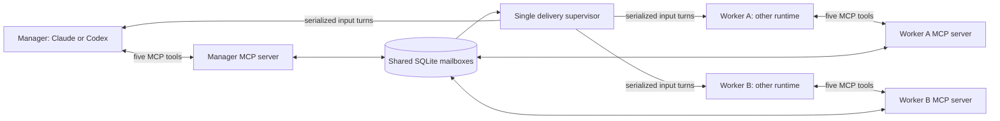

# Architecture and delivery contract

AgentRelay is a local, provider-neutral mailbox with optional runtime supervision.
Every peer gets the same MCP tool contract. The initial runtime adapters support
Codex app-server roots and Claude Code CLI sessions; additional runtimes can use
the MCP mailbox directly or implement the Python runtime interface.

The manager can be Claude with two Codex workers, or Codex with two Claude workers.
Each participant has its own MCP identity and resumable session. The same transport
also supports the original two-peer conversations.

Per-peer MCP processes share a file-backed SQLite database. Transactions serialize
message insertion, conversation limits and delivery claims. A supervisor uses a
nonblocking OS file lock to prevent a second owner from recovering active work.

Peers cannot choose a sender identity: each MCP connection binds a registered
peer ID and secret token. The administrator defines allowed recipients and
conversation participants. Reply IDs must bind the same conversation and reverse
the parent message's sender/recipient. The idempotency key is unique per sender;
an exact replay returns the original message, while conflicting reuse fails.

| Field | Meaning |
|---|---|
| `stored` | Persisted; no runtime delivery established |
| `submitted` | Claimed before dispatch; runtime outcome may still be uncertain |
| `completed` | Runtime returned a successful turn; this does not prove message processing |
| `acknowledged` | Recipient explicitly called `peer_ack`; it is an agent assertion |
| `uncertain` | Dispatch failed, was cancelled, or supervisor restarted mid-delivery |
| `failed` | Work refused before dispatch, such as a turn cap |

A recipient may read and acknowledge a `stored` message during its current turn.
The supervisor then skips a separate dispatch; the message can remain `stored`
with `acknowledged=true`. This is distinct from a completed provider dispatch.

Ordinary assistant prose is never forwarded. `peer_send` returns immediately after
storage, so an A→B→A exchange cannot deadlock inside synchronous tool calls.
The supervisor polls stored messages, starts an idle recipient, and queues delivery
behind that peer's active turn. Different peers can work concurrently.

`final=true` closes the entire conversation to new messages; existing messages
remain deliverable. A final recipient should acknowledge and stop. This global
closure also applies to conversations with more than two participants.

After restart, in-flight `submitted` messages become `uncertain` and are held;
they are never automatically replayed. Recorded healthy provider sessions are
resumed. A stale or mismatched provider session fails closed, without silently
creating another agent. The administrator must investigate uncertain outcomes and
decide whether to issue a distinct new task.

## Manager and worker topology

A manager uses the same five MCP tools as every other peer. `init --manager`
creates a star: manager can send to two workers; each worker can send only to
manager. Provider selection changes the runtime definitions, not the mailbox
contract. Workers are configured in advance and start lazily on delivery.
No runtime may create additional native children through this workflow.

The `delegation-demo` command sends two assignments, accepts the two linked results
in either arrival order, and requires final verification after both results exist.
It checks exact task results, eventual recipient ACKs and successful delivery
states. ACK timing and the manager's internal reasoning are outside its transcript
check. Manager/worker roles are instructions, not added authority: any participant
can send final=true and globally close the conversation. Premature closure fails
the example qualification; custom workflows must account for this shared contract.

## Runtime boundaries

Codex uses one owned app-server process/root per peer. It initializes JSON-RPC,
starts/resumes the root, submits a turn, and consumes completion events. Known
shell, web, browser, application, multi-agent, hook, plugin and memory features
are disabled per process; unrelated inherited MCP servers are disabled. Approval
requests are declined. CLI config and protocol behavior are version-dependent.
The code-mode host stays enabled because this CLI uses it to call MCP tools.
Codex's read-only sandbox still permits file reads; the mailbox-only instruction
is not a technical file-read isolation boundary. Use synthetic workspaces.

Claude uses `claude -p` and a recorded UUID with `--resume` for later turns. Its
process restarts each turn while its transcript/session remains the same. Built-in
tools are disabled, mailbox MCP tools explicitly allowed, inherited MCP entries
excluded, restricted mode enabled, and permission prompts denied. Stdout is
bounded to 1 MiB; stderr is continuously drained. Both adapters terminate only
their owned process groups.

These are managed peers, not entries in a desktop app's native subagent tree.
Direct external input to native Codex V2 children is restricted; an owning parent
must relay messages using its native collaboration interface. AgentRelay does
not implement that parent relay or attach to arbitrary already-running desktop
chats. MCP notifications alone do not provide idle wake.

## Limits and trust

- macOS/Linux, Python 3.12+, trusted local OS user. Windows is not supported yet.
- Tokens prevent accidental peer spoofing. A peer process or another process with
  access to the same user's files is inside the trust boundary; this is not a
  hostile multi-tenant service. Do not expose the database over a network.
- Maximum message length 16,000 characters; central conversation message cap,
  per-peer turn cap, per-turn timeout and supervisor wall-time limit.
- Claude applies its CLI budget and reported cumulative cost cap. Codex provides
  no enforced dollar cap here; its turn/time/message limits only bound activity.
  Interrupting a process does not prove a provider request stopped billing.
- Mailbox acknowledgments do not prove semantic correctness. Application-specific
  verification belongs above the transport.
- API/account limits, organizational policy and changing CLI interfaces still
  apply. Use provider-supported credentials. No credentials are supplied or
  extracted by AgentRelay; it uses locally installed authenticated CLIs.

## Primary references

- [Codex app-server protocol](https://learn.chatgpt.com/docs/app-server)
- [Codex external-input guard](https://github.com/openai/codex/blob/main/codex-rs/app-server/src/request_processors/thread_input.rs)
- [Claude Code headless usage](https://code.claude.com/docs/en/headless)
- [Claude Code CLI reference](https://code.claude.com/docs/en/cli-reference)
- [MCP tool specification](https://modelcontextprotocol.io/specification/2025-11-25/server/tools)
